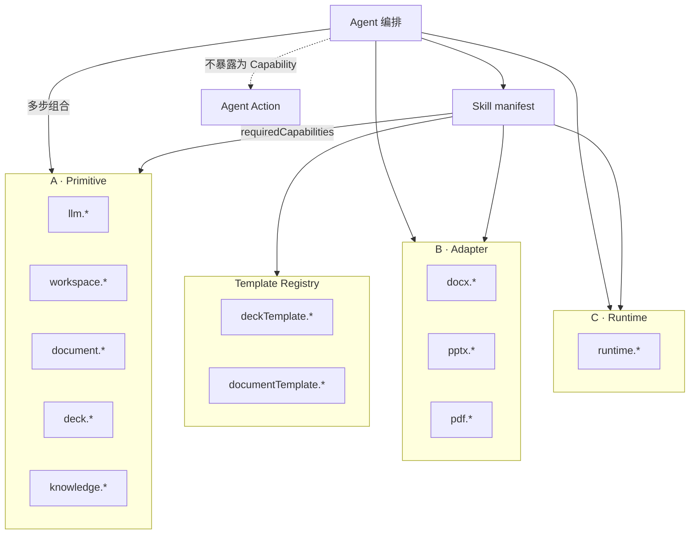

# AI Office Core Capability API（第一版 · 修订）

> 版本：v0.2（设计稿）  
> 适用范围：`ai_writer3.0-public`  
> 关联文档：[AI_OFFICE_SKILL_BOUNDARY_DESIGN.md](./AI_OFFICE_SKILL_BOUNDARY_DESIGN.md)

---

## 1. 设计原则

### 1.1 Core Capability 是什么

**Core Capability** 是 AI Office **本体提供的稳定执行 API**（非 Skill 包内代码）。第一版修订将能力按粒度分为四类，避免把底层原子能力、格式适配、运行时横切与 Agent 复合动作混在同一清单。

### 1.2 四类能力分层

| 类型 | 前缀 / 命名空间 | 定义 | Skill 是否直接声明 |
|------|-----------------|------|-------------------|
| **A. Primitive Capability** | `llm.*`、`knowledge.*`、`workspace.*`、`document.*`、`deck.*` | 真正底层、稳定、可复用的**领域原子**操作 | 是 |
| **B. Adapter Capability** | `docx.*`、`pptx.*`、`pdf.*` | 对 DOCX/PPTX/PDF 或遗留复杂模块的**格式适配** | 是（按格式） |
| **C. Runtime Capability** | `runtime.*` | 进度、日志、权限校验钩子、成本统计等**横切运行时** | 是（Workflow 常用） |
| **D. Agent Action** | 无统一 `host.call` id；文档化命名 | Agent **编排多个 Capability** 完成的复合动作 | **否**（不写入 `requiredCapabilities`） |



### 1.3 Agent 只负责任务编排

- 选择 Skill、执行 `workflow.steps` 或对话策略  
- 将 **Agent Action** 展开为若干 `host.call(primitive|adapter|runtime, …)`  
- 不内嵌 DOCX/PPTX 解析、不直连 LLM HTTP  

### 1.4 Skill 只声明依赖

Skill 的 `manifest.json` 仅列出 **A / B / C / Registry** 能力 id；**不得**把 Agent Action 登记为 `requiredCapabilities`。

### 1.5 统一执行与计费

所有副作用经 Capability 网关，返回统一信封（§2），便于权限、`cost` 与审计。

---

## 2. 统一返回格式

```json
{
  "ok": true,
  "data": {},
  "error": {
    "code": "string",
    "message": "string",
    "detail": {}
  },
  "cost": {
    "llmCalls": 0,
    "imageCalls": 0,
    "tokenEstimate": 0
  }
}
```

### 2.1 通用错误码

| code | 含义 |
|------|------|
| `CAPABILITY_NOT_FOUND` | 未知 capability id |
| `PERMISSION_DENIED` | Skill / 用户无权限 |
| `INVALID_INPUT` | 参数校验失败 |
| `WORKSPACE_NOT_FOUND` | 工作区路径无效 |
| `RESOURCE_NOT_FOUND` | 文档 / deck / 文件不存在 |
| `ENGINE_ERROR` | 底层引擎异常 |
| `LLM_UNAVAILABLE` | 模型未配置或调用失败 |
| `TIMEOUT` / `CANCELLED` | 超时 / 用户取消 |

### 2.2 字段约定（各 Capability 表格共用）

| 列 | 含义 |
|----|------|
| **Token** | 是否计入 `cost.tokenEstimate` |
| **Skill** | 普通 Template / Workflow Skill 是否允许 `host.call` |
| **失败** | `error.code` 典型值 |
| **现有代码** | 当前仓库中的实现落点（迁移参考，非运行时协议） |

---

## 3. 第一版能力总表

### 3.1 A · 通用 Primitive

| Capability | 简述 | Token | Skill |
|------------|------|-------|-------|
| `llm.generate` | 自然语言生成 | 是 | ✓ |
| `llm.generateJson` | 结构化 JSON 生成 | 是 | ✓ |
| `knowledge.retrieve` | 知识库分块检索 | 否 | ✓ |
| `workspace.readFile` | 读工作区相对路径 | 否 | ✓ |
| `workspace.writeFile` | 写工作区相对路径 | 否 | ✓ |
| `workspace.copyFile` | 复制工作区内文件 | 否 | ✓ |

### 3.2 C · Runtime

| Capability | 简述 | Token | Skill |
|------------|------|-------|-------|
| `runtime.reportProgress` | 任务步骤进度 | 否 | ✓ |
| `runtime.writeLog` | 审计 / 行为日志 | 否 | △ 受限 |

### 3.3 A · Document Primitive

| Capability | 简述 | Token | Skill |
|------------|------|-------|-------|
| `document.create` | 创建 `DocumentSchema` | 否 | ✓ |
| `document.load` | 加载 `document.json` | 否 | ✓ |
| `document.save` | 持久化文档模型 | 否 | ✓ |
| `document.applyPatch` | 块级补丁（原 `updateBlock`） | 否 | ✓ |
| `document.renderPreview` | 文档 HTML/快照预览 | 否 | ✓ |

### 3.4 B · DOCX Adapter

| Capability | 简述 | Token | Skill |
|------------|------|-------|-------|
| `docx.readPackage` | 读取 OOXML 包快照 | 否 | ✓ |
| `docx.importTemplate` | 自 DOCX 导入模板结构 | 否 | ✓ |
| `docx.extractFields` | 提取可填字段 | 否 | ✓ |
| `docx.writeback` | 按规则回写 OOXML | 否 | ✓ |
| `docx.export` | 导出 DOCX 文件 | 否 | ✓ |

### 3.5 B · PDF Adapter

| Capability | 简述 | Token | Skill |
|------------|------|-------|-------|
| `pdf.export` | 自文档/HTML/Markdown 导出 PDF | 否 | ✓ |

### 3.6 A · Deck Primitive

| Capability | 简述 | Token | Skill |
|------------|------|-------|-------|
| `deck.create` | 创建 `DeckDocument` | 否 | ✓ |
| `deck.load` | 加载 `deck.json` | 否 | ✓ |
| `deck.save` | 持久化 deck | 否 | ✓ |
| `deck.applyPatch` | 幻灯片/槽位补丁（原 `updateSlide`） | 否 | ✓ |
| `deck.render` | 渲染为 PPTX | 否 | ✓ |
| `deck.preview` | 幻灯片缩略图预览 | 否 | ✓ |

### 3.7 B · PPTX Adapter

| Capability | 简述 | Token | Skill |
|------------|------|-------|-------|
| `pptx.extract` | 从 PPTX 提取结构与文本 | 否 | ✓ |
| `pptx.import` | 一站式导入为 deck（可选便捷入口） | 否 | ✓ |

> **说明**：`pptx.import` 内部等价于 `pptx.extract` → `deck.create` → `deck.applyPatch` → `deck.save`；Agent 也可逐步调用 Primitive，不必强制使用 adapter。

### 3.8 Template Registry（元数据，非格式适配）

| Capability | 简述 | Token | Skill |
|------------|------|-------|-------|
| `deckTemplate.list` | 列出 PPT 模板 manifest | 否 | ✓ |
| `deckTemplate.validate` | 校验 deck 模板与 slot-rules | 否 | ✓ |
| `documentTemplate.list` | 列出文稿模板 manifest | 否 | ✓ |
| `documentTemplate.validate` | 校验字段 schema / writeback 规则 | 否 | ✓ |

---

## 4. v0.1 → v0.2 更名与降级

| v0.1（已废弃） | v0.2 处理 |
|----------------|-----------|
| `workspace.saveFile` | **Agent Action**；用 `workspace.writeFile` / `workspace.copyFile` + `document.save` / `deck.save` 组合 |
| `workspace.copyAsset` | 更名为 `workspace.copyFile` |
| `task.reportProgress` | 更名为 `runtime.reportProgress` |
| `task.writeLog` | 更名为 `runtime.writeLog` |
| `document.updateBlock` | 更名为 `document.applyPatch` |
| `document.preview` | 更名为 `document.renderPreview` |
| `document.importDocxTemplate` | 迁至 `docx.importTemplate` |
| `document.extractTemplateFields` | 迁至 `docx.extractFields`；校验阶段可用 `documentTemplate.validate` |
| `document.writebackToTemplate` | 迁至 `docx.writeback` |
| `document.exportDocx` | 迁至 `docx.export` |
| `document.exportPdf` | 迁至 `pdf.export` |
| `deck.updateSlide` | 更名为 `deck.applyPatch` |
| `deck.importPptx` | 拆为 `pptx.extract` + `deck.create`/`deck.save`，或 `pptx.import` |
| `deck.exportPptx` | **非**最小 Capability；**Agent Action**：`deck.render` + `workspace.copyFile` |
| `template.list` | 拆为 `deckTemplate.list` + `documentTemplate.list` |
| `template.validate` | 拆为 `deckTemplate.validate` + `documentTemplate.validate` |

### 4.1 Agent Action 示例（不进入 manifest）

| Agent Action | 典型 Capability 组合 |
|--------------|---------------------|
| `saveManuscript` | `document.save` 或 `workspace.writeFile` |
| `exportDeckToUserPath` | `deck.render` → `workspace.copyFile` |
| `importPptxAsNewDeck` | `pptx.extract` → `deck.create` → `deck.applyPatch` → `deck.save` |
| `buildDeckFromManuscript` | `document.load` → `llm.generateJson` → `deck.create` → `deck.applyPatch` → `deck.render` |
| `registerWorkspace` | 平台工作区服务（**非** Skill Capability） |

---

## 5. Capability 规格（按类）

### 5.1 A · 通用 Primitive

#### `llm.generate`

| 项 | 内容 |
|----|------|
| 输入 | `{ systemPrompt, userPrompt, temperature?, maxTokens?, images?, featureName? }` |
| 输出 | `{ text, provider, model }` |
| Token / Skill / 失败 | 是 / ✓ / `LLM_UNAVAILABLE` |
| 现有代码 | `electron/main/services/llmClient.ts` → `completeText()` |

#### `llm.generateJson`

| 项 | 内容 |
|----|------|
| 输入 | `{ systemPrompt, userPrompt, schema?, temperature?, maxTokens?, featureName? }` |
| 输出 | `{ json, rawText? }` |
| Token / Skill / 失败 | 是 / ✓ / `LLM_UNAVAILABLE`, `INVALID_JSON` |
| 现有代码 | 各服务在 `completeText` 后 `JSON.parse`（待收敛为独立入口） |

#### `knowledge.retrieve`

| 项 | 内容 |
|----|------|
| 输入 | `{ departmentId, query, constraints?, limit? }` |
| 输出 | `{ chunks[], mode }` |
| Token / Skill / 失败 | 否 / ✓ / `RESOURCE_NOT_FOUND` |
| 现有代码 | `knowledgeService.ts`；IPC `knowledge:retrieveChunks` |

#### `workspace.readFile` / `workspace.writeFile` / `workspace.copyFile`

| 项 | 内容 |
|----|------|
| 输入 | `{ workspacePath, relativePath, … }`（copy 含 `targetRelativePath`） |
| 输出 | `{ content \| size \| targetRelativePath }` |
| Token / Skill / 失败 | 否 / ✓ / `WORKSPACE_NOT_FOUND`, `RESOURCE_NOT_FOUND` |
| 现有代码 | `workspaceService.ts`；IPC `workspace:writeFile`, `workspace:copyPath` |

---

### 5.2 C · Runtime

#### `runtime.reportProgress`

| 项 | 内容 |
|----|------|
| 输入 | `{ taskId, stepId, percent, message?, status? }` |
| 输出 | `{ acknowledged: true }` |
| 现有代码 | `localTaskService.ts`；`workspace:appendTaskHistory` |

#### `runtime.writeLog`

| 项 | 内容 |
|----|------|
| 输入 | `{ module, action, eventType, details?, status? }` |
| 输出 | `{ logId? }` |
| Skill | 受限（Workflow 可用；Template 仅错误路径） |
| 现有代码 | `userActionLogService.ts` |

---

### 5.3 A · Document Primitive

#### `document.create` / `document.load` / `document.save`

| 项 | 内容 |
|----|------|
| 数据模型 | `DocumentSchema`（`src/document/schema`） |
| 现有代码 | `workspaceService.readWorkspaceDocumentSchema` / `saveWorkspaceDocumentSchema` |

#### `document.applyPatch`

| 项 | 内容 |
|----|------|
| 输入 | `{ workspacePath, patches: DocumentPatch[] }` |
| 输出 | `{ document, appliedCount }` |
| 说明 | 统一块级、选区、槽位更新；替代 v0.1 `document.updateBlock` |
| 现有代码 | `src/document/core`；`documentEngine.applyTextEdit`；`templateDocumentOrchestrator` |

#### `document.renderPreview`

| 项 | 内容 |
|----|------|
| 输入 | `{ workspacePath, document?, format?: "html" \| "snapshot" }` |
| 输出 | `{ previewHtml?, previewPath? }` |
| 现有代码 | `src/document/preview/`；`formalTemplate:preview` |

---

### 5.4 B · DOCX Adapter

#### `docx.readPackage`

| 项 | 内容 |
|----|------|
| 输入 | `{ filePath }` |
| 输出 | `{ ooxmlSnapshot }` |
| 现有代码 | IPC `documentEngine:readOoxmlPackage` |

#### `docx.importTemplate`

| 项 | 内容 |
|----|------|
| 输入 | `{ workspacePath, templatePath, mode? }` |
| 输出 | `{ document, ooxmlSnapshot? }` |
| 现有代码 | `documentSchemaDocxBoundary.importDocumentSchemaFromOoxmlSnapshot` |

#### `docx.extractFields`

| 项 | 内容 |
|----|------|
| 输入 | `{ templatePath \| documentId, workspacePath }` |
| 输出 | `{ fields[] }` |
| 现有代码 | IPC `formalTemplate:analyze` |

#### `docx.writeback` / `docx.export`

| 项 | 内容 |
|----|------|
| writeback 输入 | `{ document, templatePath, writebackRules, outputPath? }` |
| export 输入 | `{ document \| markdown \| html, targetPath?, journalFormatId? }` |
| 现有代码 | `formalTemplate:commit`；`journalDocxExporter.ts`；`pdfExporter.exportDocxToPath` |

---

### 5.5 B · PDF Adapter

#### `pdf.export`

| 项 | 内容 |
|----|------|
| 输入 | `{ markdown?, editorHtml?, title, targetPath? }` |
| 输出 | `{ filePath }` |
| 现有代码 | `pdfExporter.ts`；IPC `ai:exportPdf`, `ai:exportPdfFromEditor` |

---

### 5.6 A · Deck Primitive

#### `deck.create` / `deck.load` / `deck.save`

| 项 | 内容 |
|----|------|
| 存储 | `<workspace>/05_Presentation/decks/<deckId>/deck.json` |
| 现有代码 | `deckDocumentService.ts`；IPC `deck:load`, `deck:save` |

#### `deck.applyPatch`

| 项 | 内容 |
|----|------|
| 输入 | `{ workspacePath, deckId, slideIndex?, slots?, patches? }` |
| 说明 | 单页槽位更新或多页批量补丁；替代 `deck.updateSlide` |
| 现有代码 | IPC `deck:updateSlide`, `deck:updateDeckDocument` |

#### `deck.render` / `deck.preview`

| 项 | 内容 |
|----|------|
| render 输出 | `{ pptxPath, manifestId, warnings? }` |
| preview 输出 | `{ slides: [{ index, imagePath }] }` |
| 现有代码 | `retemplateEngine.ts`；`pptxPreviewService.ts`；IPC `deck:render`, `deck:preview` |

---

### 5.7 B · PPTX Adapter

#### `pptx.extract` / `pptx.import`

| 项 | 内容 |
|----|------|
| extract 输出 | `{ slides[], layouts?, contentPackage? }` |
| import 输出 | `{ deck, deckId }` |
| 现有代码 | `pptxImportService.ts`；IPC `deck:extractPptx`, `deck:buildFromImportedPptx` |

---

### 5.8 Template Registry

#### `deckTemplate.list` / `deckTemplate.validate`

| 项 | 内容 |
|----|------|
| 现有代码 | `pptTemplateRegistry.ts`；`src/types/pptTemplateManifest.ts`；`validateDeckDocument` |

#### `documentTemplate.list` / `documentTemplate.validate`

| 项 | 内容 |
|----|------|
| 说明 | `validate` 可合并 schema 校验 + `docx.extractFields` 结果对照 |
| 现有代码 | `src/types/templateGeneration.ts`；formal 模板流程 |

---

## 6. 调用矩阵（速查）

| 分层 | 前缀 | Skill 默认 | Agent |
|------|------|------------|-------|
| Primitive | `llm`, `knowledge`, `workspace`, `document`, `deck` | ✓ | ✓ |
| Adapter | `docx`, `pptx`, `pdf` | ✓ | ✓ |
| Runtime | `runtime` | ✓（writeLog 受限） | ✓ |
| Registry | `deckTemplate`, `documentTemplate` | ✓ | ✓ |
| Agent Action | — | ✗ | 编排实现 |

---

## 7. 宿主调用约定（目标）

```typescript
type CapabilityLayer = 'primitive' | 'adapter' | 'runtime' | 'registry'

type CapabilityId =
  | `llm.${string}`
  | `knowledge.${string}`
  | `workspace.${string}`
  | `runtime.${string}`
  | `document.${string}`
  | `deck.${string}`
  | `docx.${string}`
  | `pptx.${string}`
  | `pdf.${string}`
  | `deckTemplate.${string}`
  | `documentTemplate.${string}`

interface CapabilityInvokeRequest {
  capability: CapabilityId
  workspaceId?: string
  params: Record<string, unknown>
  caller: { type: 'agent' | 'skill' | 'ui'; id: string; skillManifestId?: string }
}

interface CapabilityResult<T = unknown> {
  ok: boolean
  data: T
  error?: { code: string; message: string; detail?: Record<string, unknown> }
  cost?: { llmCalls: number; imageCalls: number; tokenEstimate: number }
}
```

**迁移**：IPC 层逐步映射到上表 id，并统一 `CapabilityResult` 信封；**本轮不实现 registry 模块**。

---

## 8. IPC 对照（实现参考）

| v0.2 Capability | 现有 IPC / 服务 |
|-----------------|-----------------|
| `workspace.readFile` | `workspace:tree`（读目录后按需读文件） |
| `workspace.writeFile` | `workspace:writeFile` |
| `workspace.copyFile` | `workspace:copyPath` |
| `document.load` / `document.save` | `workspace:readDocumentSchema`, `workspace:saveDocumentSchema` |
| `document.applyPatch` | `documentEngine` 编辑通道 |
| `docx.readPackage` | `documentEngine:readOoxmlPackage` |
| `docx.importTemplate` | OOXML 导入边界 + formal 流程 |
| `docx.extractFields` | `formalTemplate:analyze` |
| `docx.writeback` | `formalTemplate:commit` |
| `docx.export` | `exportDocxToPath`, `exportWithJournalFormat` |
| `pdf.export` | `ai:exportPdf`, `ai:exportPdfFromEditor` |
| `knowledge.retrieve` | `knowledge:retrieveChunks` |
| `deck.*` | `deck:load`, `deck:save`, `deck:render`, `deck:preview`, `deck:updateSlide` |
| `pptx.extract` | `deck:extractPptx` |
| `pptx.import` | `deck:buildFromImportedPptx`, `pptx:importFromFile` |
| `deckTemplate.list` | `pptx:listSkills` |
| `runtime.reportProgress` | `localTaskService` / AI 事件 |

---

## 9. 范围外（后续版本）

- `image.generate` — `imageClient.ts`  
- `mail.parse` / `mail.send` — 邮件 Agent  
- `workspace.create` / `workspace.register` — 仅 Agent / UI  
- `llm.stream` — `streamText()`  

---

*文档维护：架构组 · 设计稿 v0.2 · 2026-05*
