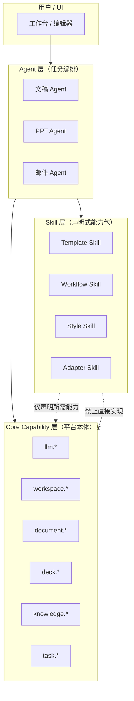

# AI Office Skill 边界设计

> 版本：v0.1（设计稿）  
> 适用范围：`ai_writer3.0-public`  
> 目标：为文稿 Skill、PPT Skill、邮件 Agent、文稿 Agent、PPT Agent 划定稳定边界，避免 Skill 与平台本体能力相互替代。

---

## 1. 架构总览



**职责分工（一句话）**

| 层级 | 职责 | 不负责 |
|------|------|--------|
| **Agent** | 理解用户意图、选择 Skill、编排步骤、处理失败与重试 | 不内嵌 DOCX/PPTX 解析、不直连 LLM HTTP |
| **Skill** | 声明模板、流程、风格、规则与所需能力 | 不替代编辑器、渲染器、文件系统 |
| **Core Capability** | 提供稳定、可审计、可计费的执行 API | 不包含业务写作策略与排版审美 |

---

## 2. 什么是 AI Office Skill

### 2.1 定义

**AI Office Skill** 是一个**可安装、可版本化、可审计**的能力包，用于向 Agent 与运行时声明：

- 本 Skill 解决哪类办公任务（如「学术论文套模板」「文稿转 PPT」）
- 需要哪些 **Core Capability**（`requiredCapabilities`）
- 输入 / 输出契约（`inputs` / `outputs`）
- 附带资产（`assets`：`.docx`、`.pptx`、schema、规则 JSON）
- 权限与流程约束（`permissions`、`workflow`）

Skill 是**声明 + 规则 + 资产**，不是可执行的二进制插件，也不是 LLM prompt 的唯一载体。

### 2.2 什么不是 Skill

以下实体**不属于** Skill，不得被包装为 Skill 来绕过平台边界：

| 实体 | 正确定位 |
|------|----------|
| 文稿编辑器（TipTap / Embedded Office） | Core + UI 运行时 |
| PPT 渲染器（`retemplateEngine`、`templateCloneRenderer`） | `deck.render` 等 Core Capability |
| DOCX 解析 / OOXML 读写 | `document.importDocxTemplate`、`documentEngine:*` |
| 知识库检索与分块 | `knowledge.retrieve` |
| LLM 网关（`llmClient`） | `llm.generate` / `llm.generateJson` |
| 文件系统与工作区目录树 | `workspace.*` |
| 用户权限、部门、租户 | 平台 Auth / Policy 服务 |
| 工作区创建、注册、树遍历 | `workspace` 管理服务 |
| 完整 Agent 实现（如邮件自动回复编排器） | Agent 层，可**引用**多个 Skill |

### 2.3 Skill 不应该直接替代的平台能力

Skill **不得**在包内重新实现或私有 fork 以下能力；只能通过 `manifest.json` 的 `requiredCapabilities` **请求**平台执行：

1. **文稿编辑器** — 块级编辑、选区、预览由 `document.*` + 前端引擎完成  
2. **PPT 渲染器** — 幻灯片合成、模板克隆由 `deck.render` 完成  
3. **DOCX 解析器** — OOXML 解包、字段提取由 `document.importDocxTemplate` / `documentEngine:readOoxmlPackage` 完成  
4. **知识库检索** — 分块、向量、任务约束由 `knowledge.retrieve` 完成  
5. **LLM 网关** — 所有模型调用必须经 `llm.generate` / `llm.generateJson`  
6. **文件系统** — 读写路径必须经 `workspace.readFile` / `workspace.writeFile` 等  
7. **用户权限** — Skill 仅声明 `permissions`，由运行时校验  
8. **工作区管理** — 创建、注册、目录结构由 `workspace` 服务统一管理  

违反上述边界的 Skill 应被安装器拒绝，或降级为「仅文档参考包」（不参与运行时）。

---

## 3. 四类 Skill

### 3.1 Template Skill（模板型）

**职责**：提供可复用的**静态结构与占位规则**，不包含完整任务编排。

| 维度 | 说明 |
|------|------|
| 典型资产 | `template.docx` / `template.pptx`、`fields.schema.json`、`slot-rules.json` |
| 输出 | 模板元数据、字段 schema、预览图、writeback 规则 |
| 不做什么 | 不调用 LLM 写全文、不决定用户任务顺序 |

### 3.2 Workflow Skill（流程型）

**职责**：声明**多步骤任务顺序**、步骤间数据传递、可选分支与验收点。

| 维度 | 说明 |
|------|------|
| 典型内容 | `workflow.steps[]`、每步 `capability` + `inputs` 映射 |
| 输出 | 流程计划（供 Agent 执行），或预编译的步骤 DAG |
| 不做什么 | 不内嵌 DOCX/PPTX 引擎、不直连模型 API |

### 3.3 Style Skill（风格型）

**职责**：约束**语气、结构偏好、排版审美参数**（非模板文件本身）。

| 维度 | 说明 |
|------|------|
| 典型内容 | `styleProfile`、段落长度、标题层级偏好、配色/字体 token |
| 输出 | 注入 `llm.generate` 的 system 片段 + `document`/`deck` 样式参数 |
| 不做什么 | 不替代 Template Skill 的物理模板 |

### 3.4 Adapter Skill（外部适配型）

**职责**：对接**外部格式或第三方约定**（邮件 MIME、高校投稿系统字段名、企业 OA 附件规范）。

| 维度 | 说明 |
|------|------|
| 典型内容 | 字段映射表、导入/导出转换规则 |
| 输出 | 标准化后的平台内部 DTO |
| 不做什么 | 不实现网络传输与鉴权（由 Core / Agent 完成） |

---

## 4. 文稿 Skill 边界

### 4.1 Document Template Skill

| 能力项 | 边界说明 |
|--------|----------|
| `template.docx` | 官方/期刊/公文空白模板文件 |
| 页眉页脚 | 在 manifest `assets` 中声明，由 `document.importDocxTemplate` 加载 |
| 段落样式 | 映射到 `DocumentSchema` 块类型与样式 ID |
| 字段 schema | `fields.schema.json`：槽位名、类型、必填、校验 |
| 引用格式 | APA / GB / 期刊引用规则 JSON，供 `document.writebackToTemplate` |
| writeback rules | 编辑器内容 → OOXML 字段回写规则，禁止 Skill 内嵌 OpenXML SDK |

**manifest 关键字段**：`kind: "template"`、`documentTemplate`、`fieldSchema`、`writebackRules`

### 4.2 Document Workflow Skill

| 流程 | 步骤示例（由 Agent 编排执行） |
|------|------------------------------|
| 论文写作 | 选题确认 → 提纲 → 分节撰写 → 引用插入 → 模板套版 → 导出 |
| 报告写作 | 需求采集 → 大纲 → 分章生成 → 领导审阅块 → 套红头模板 |
| 会议纪要 | 录音/笔记导入 → 要点提取 → 纪要结构 → 分发版式 |

**manifest 关键字段**：`kind: "workflow"`、`workflow.steps`、`requiredCapabilities`

### 4.3 Document Style Skill

| 风格 ID | 约束范围 |
|---------|----------|
| `academic` | 第三人称、被动语态偏好、摘要结构、参考文献密度 |
| `official-document` | 公文用语、主送抄送、成文日期格式 |
| `admin-notice` | 通知类标题、正文条款式、落款规范 |

Style Skill **叠加**在 Template / Workflow 之上，通过 `styleProfile` 注入 LLM 与排版参数。

---

## 5. PPT Skill 边界

### 5.1 PPT Template Skill

| 能力项 | 边界说明 |
|--------|----------|
| `template.pptx` | 母版与版式源文件 |
| `layouts` | 版式 ID → 槽位类型（title / body / image） |
| `slot-rules` | 字数上限、溢出策略、必选槽 |
| `preview` | 声明预览策略；实际 PNG 由 `deck.preview` 生成 |

对应现有类型：`src/types/pptTemplateManifest.ts`、`electron/main/services/pptTemplateRegistry.ts`

### 5.2 PPT Workflow Skill

| 流程 | 说明 |
|------|------|
| 文稿转 PPT | 输入 `document.json` → 分节映射幻灯片 → `deck.buildFromManuscript` |
| 邮件转 PPT | 输入邮件正文/附件 → 摘要页 + 要点页 |
| 研究报告转 PPT | 输入长文 + 图表资源 → 章节页 + 数据页 |

### 5.3 PPT Style Skill

| 风格 ID | 特征 |
|---------|------|
| `business-report` | 商务蓝、数据强调、页脚品牌区 |
| `academic-defense` | 答辩节奏、问题页、致谢页 |
| `training-courseware` | 章节分隔、练习题版式 |

对应现有模板：`electron/main/services/ppt/templates/*.ts`

---

## 6. `skill.md` 的定位

`skill.md`（或 `SKILL.md`）是**人类与 Agent 可读的说明文档**，不是运行时唯一协议。

| 用途 | 说明 |
|------|------|
| 说明文档 | 描述 Skill 适用场景、限制、示例 |
| Prompt 文档 | 为 Agent 提供任务分解与术语对齐 |
| 开发者 / Agent 辅助 | IDE、Cursor、内部 Agent 加载以增强理解 |
| **非**运行时唯一协议 | 运行时**必须**以 `manifest.json` 为准；`skill.md` 与 manifest 冲突时以 manifest 为准 |

参考现有仓库中的外部 Skill 文档形态：`docs/wordskill.md`、`docs/pptskill.md`（供对照，未来将迁移为规范包结构）。

---

## 7. `manifest.json` 的定位

`manifest.json` 是 AI Office 运行时**唯一可信的机器协议**（与 `skill_platform_next` 的 `.aoskin` 包内 manifest 对齐）。

| 字段族 | 用途 |
|--------|------|
| `id` / `version` / `kind` | 身份与类型（template \| workflow \| style \| adapter） |
| `requiredCapabilities` | 本 Skill 运行所需 Core Capability 列表 |
| `inputs` / `outputs` | JSON Schema 或简化类型声明 |
| `assets` | 模板与规则文件相对路径 |
| `permissions` | `workspace:write`、`knowledge:read` 等 |
| `workflow` | 流程型 Skill 的步骤定义 |

执行路径：`Agent` → 读取 manifest → `skill-engine` 校验 → `host.call(capability, …)` → 统一 `CapabilityResult` 返回。

---

## 8. manifest.json 示例

### 8.1 论文写作 Workflow Skill

```json
{
  "$schema": "https://ai-office.local/schemas/skill-manifest-v1.json",
  "id": "ai-office.document.workflow.paper-writing",
  "version": "1.0.0",
  "kind": "workflow",
  "displayName": "学术论文写作流程",
  "description": "从选题到定稿的论文写作标准流程，依赖知识库检索与期刊模板套版。",
  "requiredCapabilities": [
    "llm.generate",
    "llm.generateJson",
    "knowledge.retrieve",
    "workspace.readFile",
    "workspace.writeFile",
    "document.create",
    "document.updateBlock",
    "document.importDocxTemplate",
    "document.writebackToTemplate",
    "document.exportDocx",
    "document.exportPdf",
    "task.reportProgress"
  ],
  "inputs": {
    "type": "object",
    "required": ["workspaceId", "topic"],
    "properties": {
      "workspaceId": { "type": "string" },
      "topic": { "type": "string" },
      "templateSkillId": {
        "type": "string",
        "default": "ai-office.document.template.academic-paper"
      },
      "styleSkillId": {
        "type": "string",
        "default": "ai-office.document.style.academic"
      },
      "referenceDocumentIds": {
        "type": "array",
        "items": { "type": "string" }
      }
    }
  },
  "outputs": {
    "type": "object",
    "properties": {
      "documentId": { "type": "string" },
      "exportPaths": {
        "type": "object",
        "properties": {
          "docx": { "type": "string" },
          "pdf": { "type": "string" }
        }
      }
    }
  },
  "assets": [],
  "permissions": [
    "workspace:read",
    "workspace:write",
    "knowledge:retrieve"
  ],
  "workflow": {
    "steps": [
      {
        "id": "outline",
        "title": "生成论文提纲",
        "capability": "llm.generateJson",
        "inputs": {
          "schema": "paper-outline-v1",
          "contextFrom": ["knowledge.retrieve"]
        }
      },
      {
        "id": "draft-sections",
        "title": "分节撰写",
        "capability": "llm.generate",
        "repeat": "outline.sections",
        "inputs": { "target": "document.updateBlock" }
      },
      {
        "id": "apply-template",
        "title": "套期刊模板",
        "capability": "document.writebackToTemplate",
        "inputs": { "templateAsset": "assets/template.docx" }
      },
      {
        "id": "export",
        "title": "导出 DOCX/PDF",
        "capabilities": ["document.exportDocx", "document.exportPdf"]
      }
    ]
  }
}
```

### 8.2 学术论文 Template Skill

```json
{
  "$schema": "https://ai-office.local/schemas/skill-manifest-v1.json",
  "id": "ai-office.document.template.academic-paper",
  "version": "1.0.0",
  "kind": "template",
  "displayName": "学术论文 DOCX 模板",
  "description": "含标题页、摘要、关键词、正文层级与参考文献区域的期刊论文模板。",
  "requiredCapabilities": [
    "document.importDocxTemplate",
    "document.extractTemplateFields",
    "document.writebackToTemplate",
    "document.preview"
  ],
  "inputs": {
    "type": "object",
    "properties": {
      "workspaceId": { "type": "string" },
      "journalId": { "type": "string" }
    }
  },
  "outputs": {
    "type": "object",
    "properties": {
      "fieldSchema": { "type": "object" },
      "previewPath": { "type": "string" }
    }
  },
  "assets": [
    {
      "path": "assets/template.docx",
      "role": "document-template",
      "mime": "application/vnd.openxmlformats-officedocument.wordprocessingml.document"
    },
    {
      "path": "assets/fields.schema.json",
      "role": "field-schema"
    },
    {
      "path": "assets/writeback-rules.json",
      "role": "writeback-rules"
    },
    {
      "path": "assets/citation-style.json",
      "role": "citation-format"
    }
  ],
  "permissions": ["workspace:read"],
  "documentTemplate": {
    "engine": "document-schema",
    "headerFooter": true,
    "paragraphStyles": ["Title", "Heading1", "Heading2", "Body", "Caption"],
    "fieldBindings": {
      "title": "doc:title",
      "abstract": "doc:abstract",
      "keywords": "doc:keywords"
    }
  },
  "writebackRules": {
    "mode": "ooxml-fields",
    "rulesFile": "assets/writeback-rules.json"
  }
}
```

### 8.3 PPT Template Skill

```json
{
  "$schema": "https://ai-office.local/schemas/skill-manifest-v1.json",
  "id": "ai-office.ppt.template.business-report",
  "version": "1.0.0",
  "kind": "template",
  "displayName": "商务汇报 PPT 模板",
  "description": "16:9 商务汇报母版，含封面、目录、章节分隔、内容页与总结页版式。",
  "requiredCapabilities": [
    "deck.importPptx",
    "template.list",
    "template.validate",
    "deck.preview"
  ],
  "inputs": {
    "type": "object",
    "properties": {
      "workspaceId": { "type": "string" },
      "manifestId": {
        "type": "string",
        "default": "business_report_light"
      }
    }
  },
  "outputs": {
    "type": "object",
    "properties": {
      "templateManifest": { "type": "object" },
      "slotRules": { "type": "object" },
      "previewSlides": {
        "type": "array",
        "items": { "type": "string" }
      }
    }
  },
  "assets": [
    {
      "path": "assets/template.pptx",
      "role": "ppt-template"
    },
    {
      "path": "assets/layouts.json",
      "role": "layouts"
    },
    {
      "path": "assets/slot-rules.json",
      "role": "slot-rules"
    }
  ],
  "permissions": ["workspace:read"],
  "pptTemplate": {
    "slideSize": "16:9",
    "layouts": ["cover", "toc", "section-divider", "content", "summary"],
    "slotRulesFile": "assets/slot-rules.json",
    "preview": {
      "capability": "deck.preview",
      "maxSlides": 8
    }
  }
}
```

---

## 9. Agent 与 Skill 协作模式（后续实现指引）

| Agent | 引用的 Skill 类型 | 编排职责 |
|-------|-------------------|----------|
| 文稿 Agent | Document Template + Workflow + Style | 选择模板、执行写作流程、处理用户改稿 |
| PPT Agent | PPT Template + Workflow + Style | 选择母版、驱动 `deck.buildFrom*`、渲染导出 |
| 邮件 Agent | Adapter + Style（可选） | 解析邮件上下文，决定是否触发 PPT/文稿 Workflow |

Agent **不**解析 `template.docx` / `template.pptx` 二进制；仅传递 manifest 声明的 `asset` 路径给 Core Capability。

---

## 10. 与现有代码的关系

| 现有模块 | 迁移方向 |
|----------|----------|
| `docs/wordskill.md` / `docs/pptskill.md` | 收敛为 Skill 包内 `skill.md`，manifest 独立 |
| `skill_platform_next/` | 包格式、校验、closed-world 执行 |
| `src/modules/formal/` |  Formal Template → Document Template Skill |
| `src/modules/generation/ppt/` | Deck 构建逻辑保留在 Core；Workflow 迁入 manifest |
| `electron/main/services/paperGenerator*.ts` | 论文流程 → Workflow Skill + Agent 编排 |

---

## 11. 验收标准（设计阶段）

- [ ] 任一 Skill 包均含 `manifest.json`，且通过 schema 校验  
- [ ] 运行时拒绝 Skill 内直连 LLM / 文件系统  
- [ ] Template / Workflow / Style / Adapter 四类均有至少一个示例包  
- [ ] Agent 集成测试仅通过 `host.call(capability)` 路径  

---

*文档维护：架构组 · 设计稿 v0.1 · 2026-05*
